# HeaLyri: Technical Architecture

This document outlines the technical architecture for the HeaLyri platform, providing a comprehensive overview of system components, their interactions, and implementation details.

## System Architecture Overview

```
┌─────────────────────────────────────────────────────────────────┐
│                      Client Applications                         │
│                                                                 │
│  ┌───────────────┐                           ┌───────────────┐  │
│  │  Mobile App   │                           │  Admin Portal │  │
│  │   (Flutter)   │                           │     (Web)     │  │
│  └───────┬───────┘                           └───────┬───────┘  │
│          │                                           │          │
└──────────┼───────────────────────────────────────────┼──────────┘
           │                                           │
           ▼                                           ▼
┌─────────────────────────────────────────────────────────────────┐
│                       Firebase Backend                          │
│                                                                 │
│  ┌───────────────┐  ┌───────────────┐  ┌───────────────────┐   │
│  │ Authentication│  │Cloud Firestore│  │  Cloud Functions  │   │
│  └───────────────┘  └───────────────┘  └───────────────────┘   │
│                                                                 │
│  ┌───────────────┐  ┌───────────────┐  ┌───────────────────┐   │
│  │Cloud Storage  │  │Cloud Messaging│  │     Analytics     │   │
│  └───────────────┘  └───────────────┘  └───────────────────┘   │
│                                                                 │
└─────────────────────────────┬───────────────────────────────────┘
                              │
                              ▼
┌─────────────────────────────────────────────────────────────────┐
│                      External Services                          │
│                                                                 │
│  ┌───────────────┐  ┌───────────────┐  ┌───────────────────┐   │
│  │ Payment APIs  │  │ SafeMeds API  │  │    SMS Gateway    │   │
│  └───────────────┘  └───────────────┘  └───────────────────┘   │
│                                                                 │
│  ┌───────────────────────────────────────────────────────────┐ │
│  │                    AI/ML Services                         │ │
│  └───────────────────────────────────────────────────────────┘ │
│                                                                 │
└─────────────────────────────────────────────────────────────────┘
```

## Component Descriptions

### Client Applications

#### Mobile App (Flutter)

The primary user interface for patients and healthcare providers, built with Flutter for cross-platform compatibility across Android and iOS devices.

**Key Features:**
- User authentication and profile management
- Healthcare facility directory and search
- Appointment booking and management
- Telehealth video consultations
- Medication verification
- AI-powered triage chatbot
- Emergency services access

**Technical Specifications:**
- Flutter SDK (latest stable version)
- Dart programming language
- Provider pattern for state management
- Material Design UI components with custom theming
- Offline-first data architecture where possible
- Responsive design for various screen sizes

#### Admin Portal (Web)

A web-based dashboard for system administrators and healthcare facility staff to manage their services, appointments, and view analytics.

**Key Features:**
- Facility profile management
- Staff account administration
- Appointment scheduling and management
- Analytics and reporting
- Patient communication tools

**Technical Specifications:**
- Flutter Web for consistent codebase with mobile app
- Responsive design for desktop and tablet interfaces
- Role-based access control
- Data visualization components

### Firebase Backend

#### Authentication

Handles user registration, login, and role-based access control.

**Implementation Details:**
- Email/password authentication
- Phone number authentication
- Role-based access control (patient, provider, admin)
- Multi-factor authentication for sensitive operations
- Session management and token-based authentication

#### Cloud Firestore

NoSQL database storing user profiles, facility information, appointments, and other application data.

**Data Collections:**
- Users
- Facilities
- Appointments
- Medical Records
- Medications
- Telehealth Sessions
- Triage Conversations

**Design Principles:**
- Denormalized data structure for query efficiency
- Security rules for access control
- Indexing for common query patterns
- Data validation at the database level

#### Cloud Functions

Serverless functions handling business logic, integrations, and background tasks.

**Key Functions:**
- Appointment scheduling and notifications
- Payment processing
- Telehealth session management
- AI triage integration
- Data synchronization with external systems
- Scheduled reports and analytics

**Implementation Approach:**
- Node.js runtime
- Modular function architecture
- Event-driven design
- Comprehensive error handling and logging

#### Cloud Storage

Stores media files such as profile pictures, facility images, and medical documents.

**Storage Organization:**
- User-specific folders for profile images and documents
- Facility images and documentation
- Secure medical image storage
- Temporary storage for telehealth sessions

**Security Measures:**
- Access control through Firebase Security Rules
- Content validation on upload
- Virus scanning for uploaded documents
- Automatic file expiration for temporary content

#### Cloud Messaging

Handles push notifications for appointment reminders, telehealth alerts, and system updates.

**Notification Types:**
- Appointment reminders and updates
- Telehealth session notifications
- Emergency alerts
- Medication reminders
- System updates and announcements

**Implementation Details:**
- Topic-based subscriptions for targeted notifications
- Notification templates for consistent messaging
- Delivery tracking and analytics
- Silent notifications for data synchronization

#### Analytics

Tracks user behavior, application performance, and business metrics.

**Key Metrics:**
- User engagement and retention
- Feature usage patterns
- Appointment booking conversion rates
- Telehealth session completion rates
- Application performance and error rates

**Implementation Approach:**
- Custom event tracking
- User property segmentation
- Funnel analysis for key workflows
- Integration with Firebase Crashlytics for error tracking

### External Services

#### Payment APIs

Integration with mobile money providers and payment gateways for appointment booking fees and telehealth consultations.

**Supported Payment Methods:**
- MTN Mobile Money
- Airtel Money
- Zamtel Money
- Credit/Debit Cards (where available)

**Integration Approach:**
- Secure API communication
- Webhook-based payment confirmation
- Transaction logging and reconciliation
- Retry mechanisms for failed transactions

#### SafeMeds API

External service for verifying medication authenticity through barcode scanning or manual entry.

**Key Features:**
- Barcode validation against manufacturer database
- Counterfeit detection algorithms
- Medication information lookup
- Reporting mechanism for suspicious medications

**Integration Details:**
- REST API communication
- Response caching for common medications
- Offline verification for previously checked medications
- Secure credential management

#### SMS Gateway

Service for sending SMS notifications and reminders to users without smartphones or in areas with limited data connectivity.

**Use Cases:**
- Appointment confirmations and reminders
- One-time passwords for authentication
- Emergency notifications
- Basic health information requests

**Implementation Details:**
- Integration with local telecom providers
- Message templating system
- Delivery status tracking
- Cost optimization strategies

#### AI/ML Services

External services for symptom checking, triage, and chatbot functionality.

**Key Components:**
- Natural Language Processing for symptom understanding
- Clinical decision support algorithms
- Machine learning models for triage classification
- Conversational AI for chatbot interactions

**Integration Approach:**
- API-based communication
- Local model caching where possible
- Fallback to rule-based systems when connectivity is limited
- Continuous model improvement through feedback loops

## Data Flow

### Appointment Booking Flow


### Payment Processing Flow

```mermaid
sequenceDiagram
    participant Patient as Patient App
    participant Functions as Cloud Functions
    participant Payment as Mobile Money API
    participant Firestore as Cloud Firestore
    participant SMS as SMS Gateway

    Patient->>Functions: Initiate payment
    Functions->>Payment: Request payment
    Payment->>Functions: Payment response
    alt Payment Successful
        Functions->>Firestore: Update payment status
        Functions->>SMS: Send payment confirmation
    else Payment Failed
        Functions->>Firestore: Log payment failure
        Functions->>SMS: Send payment failure notification
    end
    Functions->>Patient: Return payment result
```



### Telehealth Consultation Flow

1. User books a telehealth consultation through the appointment system
2. At the scheduled time, both provider and patient receive notifications
3. When both parties join, a secure video session is established
4. Session metadata is stored in Firestore for record-keeping
5. After completion, both parties can provide feedback
6. Cloud Functions process the feedback and update provider ratings
7. If follow-up is needed, a new appointment can be scheduled directly

### AI Triage Flow

1. User initiates conversation with the AI triage chatbot
2. Initial messages are processed by NLP to understand the main concern
3. Based on symptoms described, the AI service determines appropriate questions
4. User responses are analyzed to assess urgency and recommended actions
5. For emergency situations, immediate connection to emergency services is offered
6. For non-emergencies, appropriate care recommendations are provided
7. Conversation history is securely stored for continuity of care
8. Anonymized data may be used for improving the AI model with user consent

## Database Schema (Simplified)

### Users Collection

```
users/
  ├── {userId}/
      ├── displayName: string
      ├── email: string
      ├── phoneNumber: string
      ├── role: string (patient, provider, admin)
      ├── createdAt: timestamp
      ├── lastLogin: timestamp
      └── profile/
          ├── address: string
          ├── dateOfBirth: timestamp
          ├── gender: string
          └── emergencyContact: string
```

### Facilities Collection

```
facilities/
  ├── {facilityId}/
      ├── name: string
      ├── type: string (hospital, clinic, pharmacy)
      ├── address: string
      ├── location: geopoint
      ├── contactPhone: string
      ├── contactEmail: string
      ├── operatingHours: map
      ├── services: array
      ├── paymentOptions: array
      └── adminUsers: array
```

### Appointments Collection

```
appointments/
  ├── {appointmentId}/
      ├── patientId: string
      ├── facilityId: string
      ├── providerId: string (optional)
      ├── serviceType: string
      ├── dateTime: timestamp
      ├── duration: number
      ├── status: string (pending, confirmed, completed, cancelled)
      ├── paymentStatus: string (pending, paid, refunded)
      ├── paymentMethod: string
      ├── paymentReference: string
      ├── createdAt: timestamp
      └── notes: string
```

## Role-Based Architecture

HeaLyri uses a role-based architecture to provide tailored experiences for different user types while maintaining a unified backend.

### User Roles

| Role | Experience | Features | Form Factor |
|------|------------|----------|------------|
| Patient | Health access | Booking, telehealth, AI, meds | Mobile-first |
| Clinic Admin | Care management | Calendar, patients, alerts | Web + mobile |
| Driver | Dispatch-on-demand | Rides, location toggle | Mobile-only |

### Role-Based Access Control

The system uses Firebase Authentication with custom claims to enforce role-based access control. This allows:

- All data living in one place
- Cross-role features (e.g., patient adds clinic; clinic sees that)
- Simplified scaling: add more roles later if needed (e.g., pharmacist)

Example Firestore document structure:

```json
{
  "user_type": "clinic",
  "clinic_id": "...",
  "assigned_patients": [...]
}
```

## Security Architecture

### Data Protection

1. **Encryption**
   - Data encrypted at rest in all Firebase services
   - TLS encryption for all data in transit
   - End-to-end encryption for telehealth sessions
   - Encrypted local storage for sensitive information on devices

2. **Access Control**
   - Role-based access control for all system components
   - Principle of least privilege for service accounts
   - Granular Firestore security rules
   - Token-based authentication with short expiration times

3. **Data Minimization**
   - Collection of only necessary personal information
   - Anonymization of data used for analytics
   - Automatic deletion of unnecessary temporary data
   - User control over data retention where possible

### Compliance Considerations

1. **Healthcare Data Regulations**
   - Compliance with Zambian health data protection laws
   - Alignment with international standards like HIPAA where applicable
   - Regular compliance audits and assessments
   - Data processing agreements with all third-party services

2. **User Consent**
   - Clear, informed consent processes for data collection
   - Granular permissions for sensitive features
   - Ability to revoke consent and delete account data
   - Age-appropriate consent mechanisms

3. **Audit Trails**
   - Comprehensive logging of all system access
   - Immutable audit records for sensitive operations
   - Regular review of access patterns
   - Anomaly detection for potential security issues

## Scalability Considerations

### Database Scaling

1. **Sharding Strategy**
   - Geographic sharding for multi-region deployment
   - Preparation for potential collection splitting as user base grows
   - Careful index design to maintain performance at scale
   - Caching strategy for frequently accessed data

2. **Query Optimization**
   - Denormalized data structure for common queries
   - Composite indexes for complex queries
   - Pagination for large result sets
   - Asynchronous aggregation for analytics queries

### Backend Scaling

1. **Serverless Architecture Benefits**
   - Automatic scaling of Cloud Functions based on demand
   - Regional deployment for reduced latency
   - Function specialization for optimal resource utilization
   - Stateless design for horizontal scalability

2. **Performance Optimization**
   - Function warm-up strategies for critical paths
   - Efficient database access patterns
   - Batch processing for high-volume operations
   - Caching of expensive computations and external API results

### Client-Side Considerations

1. **Offline Capabilities**
   - Offline data persistence for critical features
   - Background synchronization when connectivity is restored
   - Conflict resolution strategies for offline edits
   - Graceful degradation of features based on connectivity

2. **Resource Efficiency**
   - Lazy loading of non-critical assets
   - Efficient state management to minimize rebuilds
   - Image optimization for varying network conditions
   - Battery usage optimization for mobile devices

## Monitoring and DevOps

### Performance Monitoring

1. **Key Metrics**
   - API response times
   - Database query performance
   - Client-side rendering performance
   - Network request success rates
   - App startup time

2. **Alerting Strategy**
   - Real-time alerts for critical issues
   - Gradual degradation detection
   - Error rate thresholds
   - User-impacting performance degradation

### Deployment Pipeline

1. **Continuous Integration**
   - Automated testing for all code changes
   - Static code analysis
   - Dependency vulnerability scanning
   - Build verification across platforms

2. **Deployment Strategy**
   - Staged rollout for mobile app updates
   - Canary deployments for backend changes
   - Feature flags for controlled feature rollout
   - Automated rollback capabilities

### Disaster Recovery

1. **Backup Strategy**
   - Regular automated backups of all Firestore data
   - Point-in-time recovery capabilities
   - Geo-redundant storage for critical data
   - Regular backup restoration testing

2. **Business Continuity**
   - Multi-region deployment for critical services
   - Fallback mechanisms for external service dependencies
   - Degraded mode operation during partial outages
   - Clear communication protocols for system issues

## Implementation Phases

The architecture will be implemented in phases aligned with the product roadmap:

1. **MVP Phase**: Core components (Authentication, basic Firestore schema, simple Cloud Functions)
2. **Phase 2**: Integration with external services (payment gateways, SMS)
3. **Phase 3**: Advanced features (AI services, telehealth infrastructure)
4. **Phase 4**: Scaling and optimization (enhanced analytics, performance tuning)

## Future Architecture Considerations

1. **Microservices Evolution**
   - Potential migration of critical Cloud Functions to containerized microservices
   - API Gateway implementation for improved routing and security
   - Service mesh for complex service-to-service communication
   - Dedicated databases for high-throughput services

2. **Advanced AI Integration**
   - On-device ML for improved offline capabilities
   - Federated learning for privacy-preserving model improvements
   - Computer vision integration for symptom analysis
   - Voice recognition for accessibility improvements

3. **Interoperability**
   - FHIR compliance for healthcare data exchange
   - API ecosystem for third-party integrations
   - Health data import/export capabilities
   - Integration with national health information systems

4. **Edge Computing**
   - Edge functions for latency-sensitive operations
   - Regional data processing for compliance requirements
   - CDN integration for static content delivery
   - Optimized content delivery based on network conditions

## Conclusion

The HeaLyri architecture is designed to provide a robust, scalable foundation for delivering healthcare services through mobile technology. By leveraging Firebase's managed services, we can focus on developing the unique features that make HeaLyri valuable to users while ensuring security, reliability, and performance.

This architecture will evolve as the platform grows, with a focus on maintaining simplicity where possible while introducing more sophisticated components where they provide clear benefits to users or operational efficiency.
