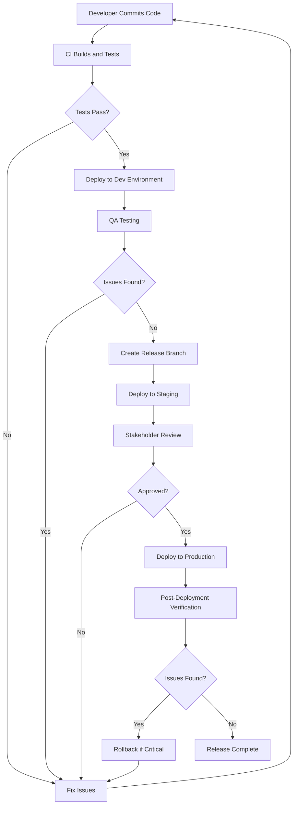

# HeaLyri: Deployment & Operations Strategy

This document outlines the deployment, operations, and maintenance strategy for the HeaLyri mobile application.

## Deployment Strategy

### Environment Architecture

HeaLyri will utilize a multi-environment approach to ensure proper testing and quality control:

1. **Development Environment**
   - Purpose: Active development and initial testing
   - Infrastructure: Development Firebase project
   - Access: Development team only
   - Data: Mock data and test accounts
   - Deployment: Manual, as needed

2. **Testing/QA Environment**
   - Purpose: Quality assurance and testing
   - Infrastructure: Testing Firebase project
   - Access: Development team and QA testers
   - Data: Structured test data
   - Deployment: Automated on merge to develop branch

3. **Staging Environment**
   - Purpose: Pre-production validation and stakeholder review
   - Infrastructure: Staging Firebase project
   - Access: Development team, QA, and key stakeholders
   - Data: Anonymized production-like data
   - Deployment: Automated on release candidate tags

4. **Production Environment**
   - Purpose: Live application for end users
   - Infrastructure: Production Firebase project
   - Access: End users and admin staff
   - Data: Real user data
   - Deployment: Controlled releases after staging validation

### Mobile App Deployment

#### Android Deployment

1. **Build Process**
   - Use Flutter's build system to generate release APK/AAB
   - Sign the application with the production keystore
   - Enable ProGuard for code obfuscation
   - Generate split APKs for different architectures

2. **Distribution Channels**
   - Primary: Google Play Store
   - Secondary: Direct APK distribution for regions with limited Play Store access
   - Enterprise: Managed Google Play for healthcare facility staff

3. **Release Tracks**
   - Internal testing: Development team
   - Closed testing: Selected beta testers
   - Open testing: Wider beta audience
   - Production: All users

4. **Versioning Strategy**
   - Semantic versioning (MAJOR.MINOR.PATCH)
   - Version code incremented with each release
   - Version name displayed to users

#### iOS Deployment

1. **Build Process**
   - Use Flutter's build system to generate release IPA
   - Sign the application with Apple Developer certificates
   - Configure App Store Connect metadata

2. **Distribution Channels**
   - Primary: Apple App Store
   - TestFlight for beta testing
   - Enterprise distribution for healthcare facility staff

3. **Release Tracks**
   - Internal testing: Development team via TestFlight
   - External testing: Selected beta testers via TestFlight
   - Production: All users via App Store

4. **Versioning Strategy**
   - Match Android versioning for consistency
   - Build number incremented with each TestFlight/App Store submission

### Backend Deployment

#### Firebase Services

1. **Authentication**
   - Configure authentication providers (email/password, phone)
   - Set up security rules and user claims
   - Implement multi-factor authentication for admin users

2. **Firestore Database**
   - Deploy security rules for each environment
   - Set up indexes for complex queries
   - Configure backup schedule

3. **Cloud Functions**
   - Deploy functions with environment-specific configurations
   - Set up proper IAM roles and permissions
   - Configure retry policies for critical functions

4. **Cloud Storage**
   - Configure CORS settings
   - Set up security rules
   - Define lifecycle policies for different file types

5. **Firebase Hosting**
   - Deploy admin portal web application
   - Configure custom domain
   - Set up caching rules

#### Deployment Automation

1. **CI/CD Pipeline**
   - Use GitHub Actions for automated builds and deployments
   - Implement deployment approval gates for production
   - Automate testing as part of the deployment process

2. **Infrastructure as Code**
   - Use Firebase CLI and configuration files for infrastructure setup
   - Version control all configuration files
   - Automate environment provisioning

3. **Deployment Scripts**
   - Create scripts for consistent deployments
   - Include rollback procedures
   - Document deployment steps

### Deployment Workflow

## Operations Strategy

### Monitoring & Alerting

#### Application Monitoring

1. **Performance Monitoring**
   - Use Firebase Performance Monitoring to track:
     - App startup time
     - Screen rendering time
     - Network request latency
     - Animation performance
   - Set up custom traces for critical user flows
   - Configure performance thresholds and alerts

2. **Error Tracking**
   - Implement Firebase Crashlytics for crash reporting
   - Set up non-fatal error logging
   - Configure error grouping and prioritization
   - Integrate with issue tracking system

3. **Usage Analytics**
   - Use Firebase Analytics to track:
     - User engagement metrics
     - Feature usage
     - Conversion funnels
     - User retention
   - Create custom events for business-critical actions
   - Set up custom dashboards for key metrics

#### Backend Monitoring

1. **Cloud Function Monitoring**
   - Track execution time and memory usage
   - Monitor error rates and failures
   - Set up alerts for function timeouts
   - Log function invocations and parameters

2. **Database Monitoring**
   - Track read/write operations
   - Monitor query performance
   - Set up alerts for excessive usage
   - Track database size and growth

3. **Authentication Monitoring**
   - Track sign-up and sign-in attempts
   - Monitor failed authentication attempts
   - Set up alerts for suspicious activities
   - Track user growth and churn

#### Infrastructure Monitoring

1. **Resource Utilization**
   - Monitor CPU, memory, and network usage
   - Track API call quotas and limits
   - Set up alerts for approaching limits
   - Monitor billing and costs

2. **Service Health**
   - Track Firebase service availability
   - Monitor third-party API availability
   - Set up alerts for service disruptions
   - Create status dashboards

### Alerting Strategy

1. **Alert Severity Levels**
   - **Critical**: Requires immediate attention (24/7)
   - **High**: Requires attention during business hours
   - **Medium**: Should be addressed in the next sprint
   - **Low**: Informational, address when convenient

2. **Alert Channels**
   - Email notifications for all alerts
   - SMS/phone calls for critical alerts
   - Slack/Teams integration for team visibility
   - Ticketing system integration for tracking

3. **Alert Routing**
   - Route alerts to appropriate teams based on component
   - Implement on-call rotation for critical alerts
   - Set up escalation paths for unacknowledged alerts

4. **Alert Thresholds**
   - Set dynamic thresholds based on historical data
   - Implement different thresholds for different environments
   - Regularly review and adjust thresholds

### Incident Management

1. **Incident Response Process**
   - Detect: Identify the incident through monitoring or reports
   - Triage: Assess severity and impact
   - Investigate: Determine root cause
   - Resolve: Implement fix or workaround
   - Recover: Restore normal operation
   - Learn: Conduct post-incident review

2. **Incident Communication**
   - Internal communication via dedicated incident channel
   - User communication for user-impacting incidents
   - Stakeholder updates for significant incidents
   - Status page updates for service availability

3. **Incident Documentation**
   - Create incident reports for all significant incidents
   - Document timeline, impact, and resolution
   - Track metrics (time to detect, time to resolve)
   - Identify action items to prevent recurrence

4. **Incident Severity Levels**
   - **P0**: Critical service outage affecting all users
   - **P1**: Major feature unavailable or severe performance degradation
   - **P2**: Minor feature unavailable or moderate performance issues
   - **P3**: Cosmetic issues or minor bugs with workarounds

### Backup & Recovery

1. **Data Backup Strategy**
   - Automated daily backups of Firestore data
   - Incremental backups throughout the day
   - Geo-redundant storage for backup data
   - Regular backup verification and testing

2. **Disaster Recovery Plan**
   - Define recovery point objective (RPO) and recovery time objective (RTO)
   - Document step-by-step recovery procedures
   - Assign roles and responsibilities
   - Conduct regular disaster recovery drills

3. **Business Continuity**
   - Identify critical business functions
   - Define acceptable downtime for each function
   - Create contingency plans for extended outages
   - Establish communication protocols during outages

## Maintenance Strategy

### Routine Maintenance

1. **Database Maintenance**
   - Regular index optimization
   - Data archiving for old records
   - Performance tuning for common queries
   - Cleanup of orphaned records

2. **Cloud Function Maintenance**
   - Review and optimize function code
   - Update dependencies and runtime versions
   - Monitor and adjust memory allocation
   - Implement and test retry logic

3. **Storage Maintenance**
   - Implement lifecycle policies for automatic cleanup
   - Archive old files to lower-cost storage
   - Remove unused or temporary files
   - Optimize image storage with appropriate formats and compression

### Update Management

1. **Dependency Updates**
   - Regular review of package dependencies
   - Scheduled updates for non-critical dependencies
   - Immediate updates for security patches
   - Comprehensive testing after updates

2. **Firebase SDK Updates**
   - Stay within one major version of the latest release
   - Test SDK updates in development before deployment
   - Schedule updates during low-traffic periods
   - Document breaking changes and migration steps

3. **OS and Platform Updates**
   - Test app on beta versions of iOS and Android
   - Update app to support new OS features
   - Address deprecated APIs before they're removed
   - Maintain compatibility with older OS versions based on user analytics

### Technical Debt Management

1. **Code Quality Monitoring**
   - Regular static code analysis
   - Scheduled code reviews
   - Track technical debt metrics
   - Allocate time in each sprint for debt reduction

2. **Refactoring Strategy**
   - Identify high-impact areas for refactoring
   - Implement the boy scout rule (leave code better than you found it)
   - Schedule dedicated refactoring sprints
   - Measure improvements in code quality metrics

3. **Documentation Maintenance**
   - Keep architecture documentation up-to-date
   - Document system changes and decisions
   - Maintain API documentation
   - Update runbooks and operational procedures

### Security Maintenance

1. **Vulnerability Management**
   - Regular security scanning of code and dependencies
   - Subscribe to security advisories
   - Prioritize and address vulnerabilities based on risk
   - Conduct periodic penetration testing

2. **Access Control Review**
   - Regular audit of user access rights
   - Review and update security rules
   - Implement principle of least privilege
   - Rotate service account keys and credentials

3. **Compliance Monitoring**
   - Track healthcare data protection regulations
   - Conduct regular compliance audits
   - Document compliance evidence
   - Update privacy policies and terms of service

## Scaling Strategy

### User Growth Planning

1. **Capacity Planning**
   - Monitor user growth trends
   - Project resource requirements
   - Plan for seasonal variations
   - Establish scaling thresholds

2. **Performance Optimization**
   - Identify and address bottlenecks
   - Optimize database queries
   - Implement caching strategies
   - Reduce payload sizes

3. **Cost Management**
   - Monitor usage costs
   - Identify cost optimization opportunities
   - Implement cost allocation tagging
   - Set up budget alerts

### Geographic Expansion

1. **Multi-Region Strategy**
   - Evaluate need for multi-region deployment
   - Plan for data residency requirements
   - Implement geo-routing for optimal performance
   - Consider content delivery networks for static assets

2. **Localization**
   - Implement internationalization framework
   - Plan for translation workflow
   - Consider cultural differences in UI/UX
   - Test with users in target regions

3. **Regulatory Compliance**
   - Research regional healthcare regulations
   - Implement region-specific compliance measures
   - Document compliance approach for each region
   - Consult with legal experts for each new region

### Feature Scaling

1. **Feature Flags**
   - Implement feature flag system
   - Use for gradual rollout of new features
   - Enable A/B testing capabilities
   - Support quick disabling of problematic features

2. **Modular Architecture**
   - Design for independent feature modules
   - Implement clear boundaries between features
   - Allow for selective enabling/disabling of features
   - Support different feature sets for different user segments

3. **API Versioning**
   - Implement versioned APIs
   - Support backward compatibility
   - Plan for deprecation cycles
   - Document API changes

## Operational Procedures

### Deployment Procedures

#### Mobile App Release

1. **Pre-Release Checklist**
   - Verify all tests pass
   - Check for regression issues
   - Review analytics implementation
   - Verify proper versioning
   - Ensure proper environment configuration

2. **Release Process**
   - Create release branch
   - Generate release build
   - Submit to app stores
   - Monitor review process
   - Prepare release notes

3. **Post-Release Verification**
   - Verify app availability in stores
   - Conduct smoke tests on production
   - Monitor initial user feedback
   - Track crash reports and errors
   - Verify analytics data collection

#### Backend Deployment

1. **Pre-Deployment Checklist**
   - Review security rules
   - Verify database indexes
   - Check function configurations
   - Review environment variables
   - Backup current state

2. **Deployment Process**
   - Deploy to staging environment
   - Conduct integration tests
   - Get stakeholder approval
   - Schedule production deployment
   - Execute deployment with monitoring

3. **Post-Deployment Verification**
   - Verify service health
   - Run automated smoke tests
   - Monitor error rates
   - Check performance metrics
   - Verify data integrity

### Rollback Procedures

1. **Mobile App Rollback**
   - Criteria for rollback decision
   - Process for halting phased rollout
   - Steps to revert to previous version
   - Communication plan for users

2. **Backend Rollback**
   - Database restore procedures
   - Function version rollback
   - Security rules reversion
   - Verification steps after rollback

3. **Data Recovery**
   - Point-in-time recovery procedures
   - Data integrity verification
   - Conflict resolution approach
   - User data reconciliation

### Routine Operations

1. **Daily Operations**
   - Monitor system health
   - Review error reports
   - Check performance metrics
   - Address critical issues

2. **Weekly Operations**
   - Review usage analytics
   - Check resource utilization
   - Update status reports
   - Plan for upcoming releases

3. **Monthly Operations**
   - Conduct security reviews
   - Review and optimize costs
   - Update documentation
   - Plan capacity for next quarter

4. **Quarterly Operations**
   - Conduct disaster recovery drill
   - Review and update policies
   - Evaluate technology stack
   - Plan for major upgrades

## Support Strategy

### User Support

1. **Support Channels**
   - In-app support chat
   - Email support
   - Phone support for critical issues
   - FAQ and knowledge base

2. **Support Tiers**
   - Tier 1: Basic user issues and questions
   - Tier 2: Technical issues requiring investigation
   - Tier 3: Complex issues requiring developer intervention

3. **Response Time Targets**
   - Critical issues: 1 hour response, 4 hour resolution
   - High priority: 4 hour response, 24 hour resolution
   - Medium priority: 24 hour response, 72 hour resolution
   - Low priority: 48 hour response, 1 week resolution

4. **Issue Tracking**
   - Use ticketing system for all support requests
   - Track issue categories and trends
   - Measure resolution times
   - Collect user satisfaction metrics

### Provider Support

1. **Onboarding Support**
   - Guided setup process
   - Training materials and documentation
   - Dedicated onboarding specialist
   - Post-onboarding check-ins

2. **Operational Support**
   - Dashboard for facility management
   - Priority support channel
   - Regular usage reports
   - Scheduled check-in calls

3. **Technical Support**
   - Integration assistance
   - Data migration support
   - Custom configuration help
   - API usage guidance

### Internal Support

1. **Developer Support**
   - Development environment troubleshooting
   - Code review assistance
   - Architecture consultation
   - Performance optimization guidance

2. **Operations Support**
   - Deployment assistance
   - Monitoring setup help
   - Alert configuration
   - Incident response guidance

3. **Documentation**
   - Internal knowledge base
   - Runbooks for common issues
   - Architecture documentation
   - API documentation

## Continuous Improvement

### Metrics & KPIs

1. **Operational Metrics**
   - System uptime and availability
   - Error rates and crash-free users
   - API response times
   - Deployment frequency and success rate
   - Mean time to detect (MTTD) and mean time to resolve (MTTR)

2. **User Experience Metrics**
   - App startup time
   - Screen load times
   - Task completion rates
   - User satisfaction scores
   - App store ratings

3. **Business Metrics**
   - User acquisition and retention
   - Feature adoption rates
   - Appointment booking conversion
   - Telehealth session completion
   - Revenue metrics (if applicable)

### Feedback Loops

1. **User Feedback**
   - In-app feedback mechanism
   - App store reviews
   - User surveys
   - Usability testing
   - Support ticket analysis

2. **Provider Feedback**
   - Regular check-in calls
   - Provider surveys
   - Feature request tracking
   - Advisory board input

3. **Team Feedback**
   - Sprint retrospectives
   - Incident post-mortems
   - Developer experience surveys
   - Cross-functional reviews

### Improvement Process

1. **Identify**
   - Collect feedback and metrics
   - Identify pain points and opportunities
   - Prioritize based on impact and effort

2. **Plan**
   - Define improvement objectives
   - Design solutions
   - Create implementation plan
   - Set success criteria

3. **Implement**
   - Execute improvements
   - Monitor impact
   - Adjust as needed
   - Document changes

4. **Review**
   - Evaluate against success criteria
   - Gather feedback on improvements
   - Identify lessons learned
   - Plan next improvement cycle

## Risk Management

### Operational Risks

1. **Service Disruption**
   - Risk: Firebase or third-party service outages
   - Mitigation: Service redundancy where possible, degraded mode operation
   - Contingency: Clear communication plan, manual workarounds

2. **Data Loss or Corruption**
   - Risk: Accidental deletion, corruption, or unauthorized access
   - Mitigation: Regular backups, strict access controls, data validation
   - Contingency: Data recovery procedures, point-in-time restoration

3. **Performance Degradation**
   - Risk: Increased load, inefficient queries, resource constraints
   - Mitigation: Performance monitoring, load testing, optimization
   - Contingency: Scaling plan, feature throttling, emergency optimization

### Compliance Risks

1. **Regulatory Changes**
   - Risk: Changes in healthcare data regulations
   - Mitigation: Regulatory monitoring, flexible architecture
   - Contingency: Rapid compliance implementation plan, legal consultation

2. **Data Privacy Violations**
   - Risk: Unauthorized access or disclosure of patient data
   - Mitigation: Encryption, access controls, privacy by design
   - Contingency: Breach response plan, notification procedures

3. **Non-Compliance Penalties**
   - Risk: Failure to meet regulatory requirements
   - Mitigation: Regular compliance audits, staff training
   - Contingency: Remediation plan, legal support

### Business Risks

1. **User Adoption Challenges**
   - Risk: Low uptake by patients or providers
   - Mitigation: User research, gradual rollout, feedback collection
   - Contingency: Feature prioritization adjustment, marketing strategy revision

2. **Competitive Pressure**
   - Risk: Similar solutions entering the market
   - Mitigation: Unique value proposition, innovation pipeline
   - Contingency: Differentiation strategy, partnership opportunities

3. **Resource Constraints**
   - Risk: Limited development or operational resources
   - Mitigation: Efficient resource allocation, prioritization framework
   - Contingency: Outsourcing plan, feature scope adjustment

## Documentation

### Operational Documentation

1. **System Architecture**
   - Component diagrams
   - Data flow diagrams
   - Integration points
   - Security architecture

2. **Deployment Guides**
   - Environment setup
   - Deployment procedures
   - Configuration management
   - Rollback procedures

3. **Runbooks**
   - Incident response procedures
   - Common issue troubleshooting
   - Backup and recovery
   - Scaling procedures

4. **Monitoring Documentation**
   - Alert definitions and thresholds
   - Dashboard explanations
   - Metrics dictionary
   - Log query examples

### User Documentation

1. **User Guides**
   - Feature walkthroughs
   - Common task instructions
   - Troubleshooting tips
   - FAQ

2. **Provider Documentation**
   - Facility setup guide
   - Staff onboarding
   - Appointment management
   - Reporting features

3. **Admin Documentation**
   - User management
   - System configuration
   - Content management
   - Analytics interpretation

### Developer Documentation

1. **API Documentation**
   - Endpoint descriptions
   - Request/response formats
   - Authentication requirements
   - Rate limits and quotas

2. **Codebase Documentation**
   - Code organization
   - Design patterns
   - Contribution guidelines
   - Testing approach

3. **Integration Documentation**
   - Third-party integration guides
   - Webhook specifications
   - Authentication flows
   - Data exchange formats

## Conclusion

This deployment and operations strategy provides a comprehensive framework for successfully launching and maintaining the HeaLyri application. By following these guidelines, the team can ensure reliable service delivery, efficient operations, and continuous improvement of the platform.

The strategy should be reviewed and updated regularly to adapt to changing requirements, technologies, and best practices. As the application grows and evolves, operational procedures should be refined based on real-world experience and feedback.

Successful implementation of this strategy will result in a stable, secure, and scalable healthcare platform that delivers value to patients, healthcare providers, and administrators in Zambia.
