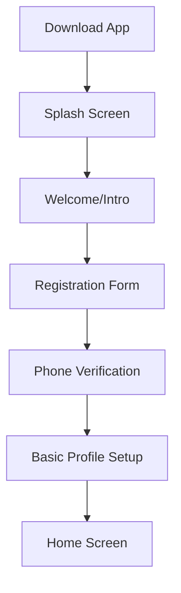
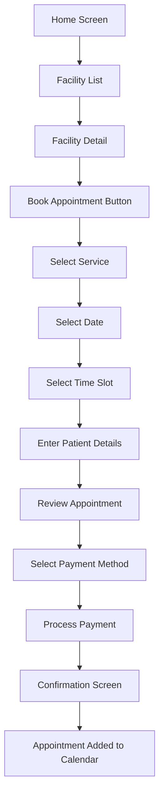
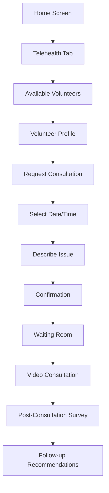
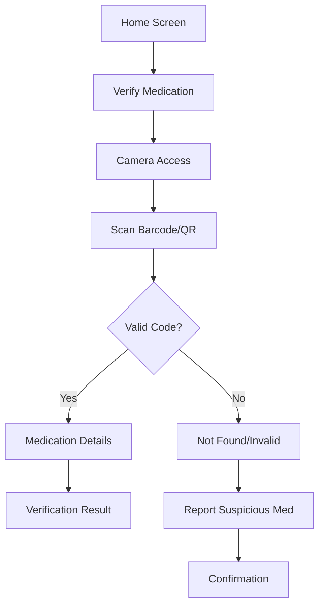
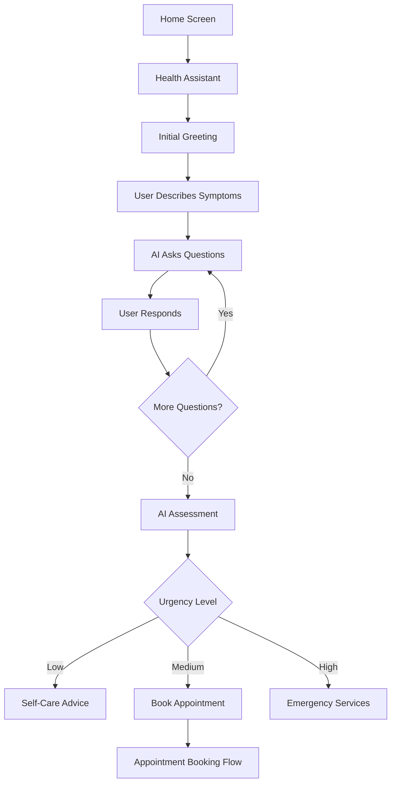

# HeaLyri: UI/UX Design Guidelines

This document outlines the user interface and user experience design principles for the HeaLyri mobile application.

## Design Philosophy

HeaLyri's design is guided by the following principles:

1. **Accessibility First**: Design for users of all abilities, including those with limited tech literacy or physical impairments.
2. **Simplicity**: Clear, straightforward interfaces that reduce cognitive load.
3. **Consistency**: Uniform patterns and components throughout the app.
4. **Contextual Relevance**: Present information and actions that are relevant to the user's current task.
5. **Offline Friendliness**: Design for intermittent connectivity.
6. **Cultural Sensitivity**: Respect local cultural norms and preferences.

## Brand Identity

### Color Palette

Primary colors:

- **Primary Blue** (#1E88E5): Main brand color, used for primary actions and key UI elements
- **Secondary Teal** (#26A69A): Used for secondary actions and accents
- **Alert Red** (#E53935): Used for errors, alerts, and critical information
- **Success Green** (#43A047): Used for success states and positive feedback
- **Warning Amber** (#FFB300): Used for warnings and cautionary information

Neutral colors:

- **Dark Gray** (#424242): Primary text color
- **Medium Gray** (#757575): Secondary text color
- **Light Gray** (#EEEEEE): Backgrounds, dividers
- **White** (#FFFFFF): Card backgrounds, primary content areas

### Typography

- **Primary Font**: Roboto (Android) / San Francisco (iOS)
- **Heading Sizes**:
  - H1: 24sp, Bold
  - H2: 20sp, Bold
  - H3: 18sp, Medium
  - H4: 16sp, Medium
- **Body Text**: 14sp, Regular
- **Small Text/Captions**: 12sp, Regular
- **Button Text**: 14sp, Medium

### Iconography

- Use outlined icons for consistency
- 24dp x 24dp standard size
- 2dp stroke width
- Rounded corners (2dp radius)
- Use standard Material Design or SF Symbols icons where possible

## Design System Components

### Buttons

**Primary Button**
- Height: 48dp
- Background: Primary Blue
- Text: White, 14sp, Medium
- Corner Radius: 8dp
- Padding: 16dp horizontal

**Secondary Button**
- Height: 48dp
- Border: 1dp Primary Blue
- Background: Transparent
- Text: Primary Blue, 14sp, Medium
- Corner Radius: 8dp
- Padding: 16dp horizontal

**Text Button**
- Height: 48dp
- Background: Transparent
- Text: Primary Blue, 14sp, Medium
- Padding: 8dp horizontal

**Icon Button**
- Size: 48dp x 48dp
- Touch Target: Minimum 48dp x 48dp
- Icon Size: 24dp x 24dp

### Cards

**Standard Card**
- Background: White
- Corner Radius: 8dp
- Elevation: 2dp
- Padding: 16dp
- Margin: 8dp

**Facility Card**
- Background: White
- Corner Radius: 8dp
- Elevation: 2dp
- Image Height: 120dp
- Content Padding: 16dp
- Margin: 8dp

**Appointment Card**
- Background: White
- Corner Radius: 8dp
- Elevation: 2dp
- Left Border: 4dp (color varies by status)
- Content Padding: 16dp
- Margin: 8dp

### Form Elements

**Text Input**
- Height: 56dp
- Background: Light Gray
- Text: Dark Gray, 14sp
- Label: Medium Gray, 12sp
- Corner Radius: 4dp
- Padding: 16dp horizontal

**Dropdown/Select**
- Height: 56dp
- Background: Light Gray
- Text: Dark Gray, 14sp
- Label: Medium Gray, 12sp
- Corner Radius: 4dp
- Padding: 16dp horizontal
- Icon: Chevron Down, 24dp

**Checkbox**
- Size: 24dp x 24dp
- Touch Target: 48dp x 48dp
- Color: Primary Blue (when selected)

**Radio Button**
- Size: 24dp x 24dp
- Touch Target: 48dp x 48dp
- Color: Primary Blue (when selected)

**Toggle/Switch**
- Height: 24dp
- Width: 40dp
- Thumb Size: 20dp
- Color: Primary Blue (when on)

### Navigation

**Bottom Navigation Bar**
- Height: 56dp
- Background: White
- Active Icon/Text: Primary Blue
- Inactive Icon/Text: Medium Gray
- Icons: 24dp

**Top App Bar**
- Height: 56dp
- Background: White
- Title: Dark Gray, 18sp, Medium
- Elevation: 4dp
- Icon Buttons: 48dp x 48dp

**Tab Bar**
- Height: 48dp
- Background: White
- Active Tab: Primary Blue text, 14sp, Medium
- Inactive Tab: Medium Gray text, 14sp, Medium
- Indicator: 2dp Primary Blue

### Dialogs & Modals

**Alert Dialog**
- Background: White
- Corner Radius: 8dp
- Title: 18sp, Medium
- Content: 14sp, Regular
- Buttons: Text Buttons, aligned right
- Padding: 24dp

**Bottom Sheet**
- Background: White
- Top Corner Radius: 8dp
- Drag Handle: 32dp x 4dp, Light Gray
- Padding: 16dp

**Toast/Snackbar**
- Background: Dark Gray
- Text: White, 14sp
- Corner Radius: 4dp
- Padding: 16dp
- Duration: 3 seconds (default)

## Screen Layouts

### Splash & Onboarding

```
┌────────────────────────┐
│                        │
│                        │
│                        │
│                        │
│         LOGO           │
│                        │
│                        │
│                        │
│                        │
│                        │
│                        │
│  [Primary Button]      │
│  [Secondary Button]    │
│                        │
└────────────────────────┘
```

### Authentication Screens

```
┌────────────────────────┐
│ ← Back                 │
│                        │
│ Title                  │
│ Subtitle               │
│                        │
│ ┌──────────────────┐   │
│ │ Email            │   │
│ └──────────────────┘   │
│                        │
│ ┌──────────────────┐   │
│ │ Password         │   │
│ └──────────────────┘   │
│                        │
│ [Primary Button]       │
│                        │
│ Text Button            │
│                        │
└────────────────────────┘
```

### Home Screen

```
┌────────────────────────┐
│ Title         [Icons]  │
│                        │
│ ┌──────────────────┐   │
│ │ Search           │   │
│ └──────────────────┘   │
│                        │
│ Upcoming Appointments  │
│ ┌──────────────────┐   │
│ │ Appointment Card │   │
│ └──────────────────┘   │
│                        │
│ Nearby Facilities      │
│ ┌──────────────────┐   │
│ │ Facility Card    │   │
│ └──────────────────┘   │
│                        │
│ [Bottom Navigation]    │
└────────────────────────┘
```

### Facility List

```
┌────────────────────────┐
│ Facilities    [Filter] │
│                        │
│ ┌──────────────────┐   │
│ │ Search           │   │
│ └──────────────────┘   │
│                        │
│ ┌──────────────────┐   │
│ │ Facility Card    │   │
│ └──────────────────┘   │
│                        │
│ ┌──────────────────┐   │
│ │ Facility Card    │   │
│ └──────────────────┘   │
│                        │
│ ┌──────────────────┐   │
│ │ Facility Card    │   │
│ └──────────────────┘   │
│                        │
│ [Bottom Navigation]    │
└────────────────────────┘
```

### Facility Detail

```
┌────────────────────────┐
│ ← Back         [Icons] │
│ ┌──────────────────┐   │
│ │                  │   │
│ │     Image        │   │
│ │                  │   │
│ └──────────────────┘   │
│                        │
│ Facility Name          │
│ Type • Location        │
│ Rating                 │
│                        │
│ [Tab Bar]              │
│ ┌──────────────────┐   │
│ │ Tab Content      │   │
│ │                  │   │
│ │                  │   │
│ └──────────────────┘   │
│                        │
│ [Book Appointment]     │
└────────────────────────┘
```

### Appointment Booking

```
┌────────────────────────┐
│ ← Back                 │
│                        │
│ Book Appointment       │
│                        │
│ Facility Name          │
│                        │
│ ┌──────────────────┐   │
│ │ Service Type     ▼│   │
│ └──────────────────┘   │
│                        │
│ Date Selection         │
│ [Calendar]             │
│                        │
│ Time Slots             │
│ [Time Slot Grid]       │
│                        │
│ [Continue]             │
└────────────────────────┘
```

### Appointment Confirmation

```
┌────────────────────────┐
│ ← Back                 │
│                        │
│ Confirm Appointment    │
│                        │
│ ┌──────────────────┐   │
│ │ Appointment      │   │
│ │ Details          │   │
│ └──────────────────┘   │
│                        │
│ ┌──────────────────┐   │
│ │ Payment Method   ▼│   │
│ └──────────────────┘   │
│                        │
│ Amount: $XX.XX         │
│                        │
│ [Confirm & Pay]        │
│                        │
└────────────────────────┘
```

### Appointment List

```
┌────────────────────────┐
│ Appointments  [Filter] │
│                        │
│ [Tab Bar]              │
│ Upcoming | Past        │
│                        │
│ ┌──────────────────┐   │
│ │ Appointment Card │   │
│ └──────────────────┘   │
│                        │
│ ┌──────────────────┐   │
│ │ Appointment Card │   │
│ └──────────────────┘   │
│                        │
│ ┌──────────────────┐   │
│ │ Appointment Card │   │
│ └──────────────────┘   │
│                        │
│ [Bottom Navigation]    │
└────────────────────────┘
```

### Telehealth Session

```
┌────────────────────────┐
│ ← End Call    [Icons]  │
│                        │
│ ┌──────────────────┐   │
│ │                  │   │
│ │  Provider Video  │   │
│ │                  │   │
│ └──────────────────┘   │
│                        │
│ ┌────┐                 │
│ │User│                 │
│ │Vid │                 │
│ └────┘                 │
│                        │
│ [Mute] [Camera] [Chat] │
│                        │
└────────────────────────┘
```

### Drug Verification

```
┌────────────────────────┐
│ Verify Medication      │
│                        │
│ ┌──────────────────┐   │
│ │                  │   │
│ │  Camera View     │   │
│ │                  │   │
│ │                  │   │
│ │                  │   │
│ │                  │   │
│ └──────────────────┘   │
│                        │
│ Position barcode in    │
│ the frame to scan      │
│                        │
│ [Enter Code Manually]  │
│                        │
│ [Bottom Navigation]    │
└────────────────────────┘
```

### AI Triage Chat

```
┌────────────────────────┐
│ ← Back                 │
│                        │
│ Health Assistant       │
│                        │
│ ┌──────────────────┐   │
│ │ Bot Message      │   │
│ └──────────────────┘   │
│                        │
│ ┌──────────────────┐   │
│ │ User Message     │   │
│ └──────────────────┘   │
│                        │
│ ┌──────────────────┐   │
│ │ Bot Message      │   │
│ └──────────────────┘   │
│                        │
│ ┌──────────────────┐   │
│ │ Type a message   │ ▶ │
│ └──────────────────┘   │
└────────────────────────┘
```

## User Flows

### Patient Registration Flow



### Appointment Booking Flow



### Telehealth Consultation Flow



### Drug Verification Flow



### AI Triage Flow



## Accessibility Guidelines

### Text & Typography

- Maintain minimum text size of 14sp for body text
- Ensure sufficient contrast (minimum 4.5:1 for normal text, 3:1 for large text)
- Avoid using color as the only means of conveying information
- Support dynamic text sizing (respond to system font size settings)

### Touch Targets

- Minimum touch target size of 48dp x 48dp
- Adequate spacing between interactive elements (minimum 8dp)
- Provide visual feedback for all interactive elements

### Screen Readers

- All images must have meaningful alt text
- Form fields must have proper labels
- Custom components must support accessibility services
- Logical navigation order for screen readers

### Additional Considerations

- Support both portrait and landscape orientations
- Provide alternatives to gesture-based interactions
- Ensure sufficient time for reading notifications
- Allow users to disable animations

## Responsive Design

The app should adapt to different screen sizes and orientations:

- **Small Phones** (< 360dp width):
  - Stack elements vertically where possible
  - Reduce padding to 12dp
  - Use smaller card sizes

- **Medium Phones** (360dp - 400dp width):
  - Standard layout as shown in wireframes
  - 16dp padding

- **Large Phones** (> 400dp width):
  - Increase white space
  - Consider two-column layouts for some screens
  - 20dp padding

- **Tablets**:
  - Two-column layouts for most screens
  - Master-detail views where appropriate
  - 24dp padding

## Loading States & Error Handling

### Loading States

- Use skeleton screens for content loading
- Show progress indicators for actions
- Maintain context during loading (don't clear the screen)

### Error States

- Provide clear error messages
- Suggest actions to resolve errors
- Use appropriate visual cues (icons, colors)
- Allow retry options where applicable

### Empty States

- Provide helpful guidance for empty lists
- Use illustrations to explain the purpose of the screen
- Include clear call-to-action buttons

## Animation Guidelines

- Use subtle animations for transitions (duration: 300ms)
- Employ material motion patterns (shared element transitions)
- Ensure animations can be disabled for accessibility
- Keep animations consistent throughout the app

## Localization Considerations

- Design with text expansion/contraction in mind (some languages require more space)
- Use culturally appropriate imagery and icons
- Support right-to-left layouts for Arabic and other RTL languages
- Consider local color associations and symbolism

## Implementation Notes

### Flutter Implementation

- Use Flutter's Material Design components as a foundation
- Create a consistent theme using ThemeData
- Implement custom widgets for reusable components
- Use MediaQuery to adapt to different screen sizes
- Leverage Flutter's accessibility widgets (Semantics, ExcludeSemantics)

### Design Handoff

- Provide developers with:
  - Component specifications (dimensions, colors, typography)
  - Interactive prototypes for complex interactions
  - Asset files (icons, illustrations) in appropriate formats
  - Responsive behavior guidelines

## Design Review Checklist

Before finalizing designs, ensure:

- [ ] All screens follow the design system
- [ ] Accessibility guidelines are met
- [ ] Responsive layouts are defined
- [ ] User flows are complete and logical
- [ ] Error states and edge cases are addressed
- [ ] Localization considerations are accounted for
- [ ] Designs are reviewed with stakeholders

## Next Steps

1. Create high-fidelity mockups for all screens
2. Develop interactive prototypes for key user flows
3. Conduct usability testing with representative users
4. Refine designs based on feedback
5. Prepare design assets for development
6. Create a design system documentation for developers
